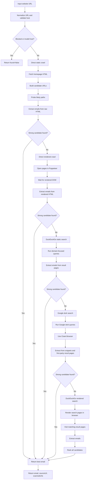

# Business Email Discovery Flow

This document explains how the business email finder works in the backend, how to test it, and why it sometimes finds emails that do not match the business website's main domain.

## Entry points

Main service:

- `server/src/modules/leads/business-email.service.ts`

Test script:

- `server/src/scripts/business-email-test.ts`

Run it with:

```bash
npm run business-email:test -- --website "https://www.bowerydental.com"
```

Example:

```bash
npm run business-email:test -- --website "https://www.rotorooter.com/manhattan/"
```

The script prints JSON like:

```json
{
  "website": "https://www.rotorooter.com/manhattan/",
  "found": true,
  "email": "roto-rooter@rrsc-email.com",
  "sourceUrl": "https://www.rotorooter.com/schedule-service/thank-you/",
  "scannedUrls": [
    "https://www.rotorooter.com/manhattan/",
    "https://www.rotorooter.com/schedule-service/thank-you/"
  ]
}
```

## What it does

The service tries multiple strategies in sequence and returns early when it finds a strong email candidate.

High-level goals:

- Find a real contact email for a business website.
- Prefer first-party emails when available.
- Still accept hosted or routing emails found on first-party pages.
- Keep a trace of where the email came from through `sourceUrl` and `scannedUrls`.

## Strategy order

1. Direct static crawl
2. Direct rendered crawl with Puppeteer
3. DuckDuckGo static search
4. Google dork search with Cloak Browser
5. DuckDuckGo rendered search

Each strategy contributes email candidates. At the end of each stage, the service ranks candidates and returns as soon as a good one is found.

## Mermaid diagram



## Direct crawl details

The direct crawl starts from the homepage and a set of likely contact paths, such as:

- `/contact`
- `/contact-us`
- `/about`
- `/team`
- `/support`
- `/schedule-service/thank-you/`
- `/thank-you/`

It also scans links found on the homepage and keeps same-site URLs that look relevant to contact discovery.

This is why hidden contact pages can still be found even if they do not appear in search results.

## Search engine details

The service uses two external search styles:

### DuckDuckGo

- HTML search results pages
- Direct result-page fetches
- Rendered fallback via Puppeteer

### Google dorks

The Google stage uses `cloakbrowser/puppeteer` and runs queries like:

- `site:{domain} ("@{domain}" OR "mailto:")`
- `site:{domain} ("email" OR "contact us" OR "thank you" OR "schedule service")`
- `site:{domain} ("rrsc-email.com" OR "email us" OR "customer service")`
- `site:{domain} filetype:pdf ("@{domain}" OR "email")`

Then it:

- extracts emails from the Google results page/snippets
- visits matching first-party result pages
- extracts emails from the fetched HTML

## Candidate ranking

Every discovered email becomes a candidate with:

- `email`
- `sourceUrl`
- `strategy`

The scorer prefers:

- same-domain emails like `info@business.com`
- common mailbox names like `info`, `contact`, `support`, `sales`
- emails found on first-party pages

It also accepts off-domain emails when they appear on trusted first-party pages.

Example:

- `roto-rooter@rrsc-email.com` is not on `rotorooter.com`
- but it is valid because it appears on a real Rotor-Rooter page
- so it gets promoted by the first-party source bonus

This prevents false negatives for businesses that use external routing or hosted contact systems.

## Rotor-Rooter example

For:

```bash
npm run business-email:test -- --website "https://www.rotorooter.com/manhattan/"
```

The working result is:

- Email: `roto-rooter@rrsc-email.com`
- Source page: `https://www.rotorooter.com/schedule-service/thank-you/`

Why this matters:

- the email is real and present in page HTML
- it does not match the main website domain
- a domain-only filter would incorrectly reject it

## Output fields

The test script returns:

- `found`: whether any acceptable email was found
- `email`: the selected best email, or `null`
- `sourceUrl`: the page where the winning email was found
- `scannedUrls`: all URLs or search pages checked during the run

## Notes and limitations

- Some sites hide emails behind forms, APIs, or logged-in flows.
- Some results only appear on unusual thank-you or service pages.
- Search engines may rate-limit or vary results over time.
- The service is intentionally conservative about social-media hosts and unrelated third-party sites.

## Related files

- `server/src/modules/leads/business-email.service.ts`
- `server/src/scripts/business-email-test.ts`
- `server/src/modules/leads/google-maps.service.ts`
- `server/src/modules/leads/yellow-pages.service.ts`
- `server/src/modules/leads/yelp.service.ts`
